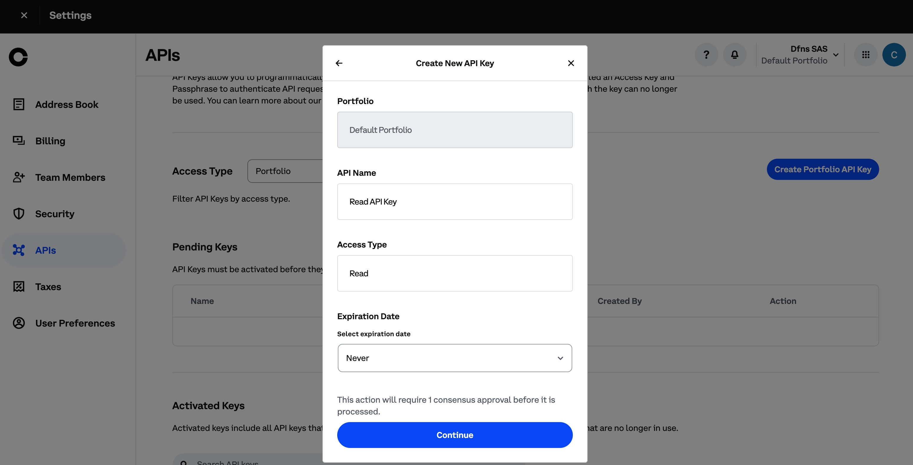
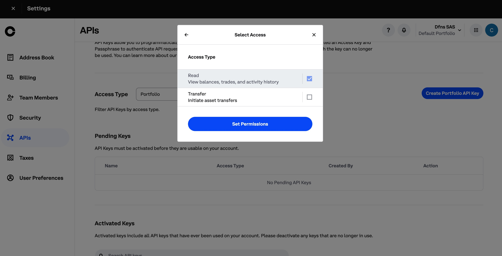
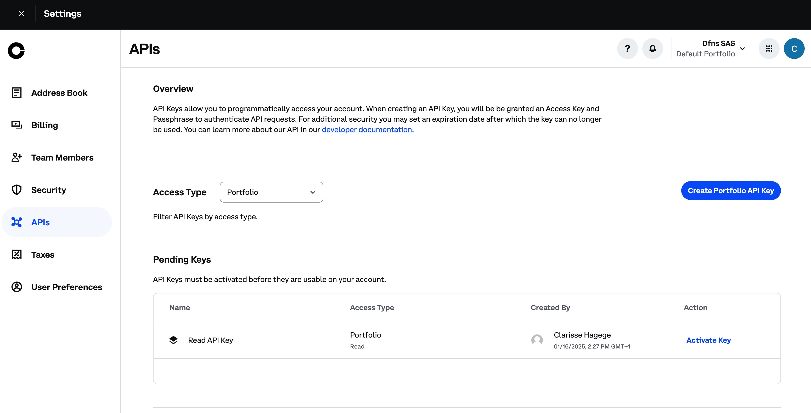
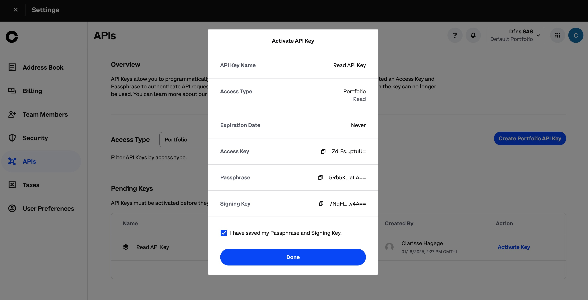
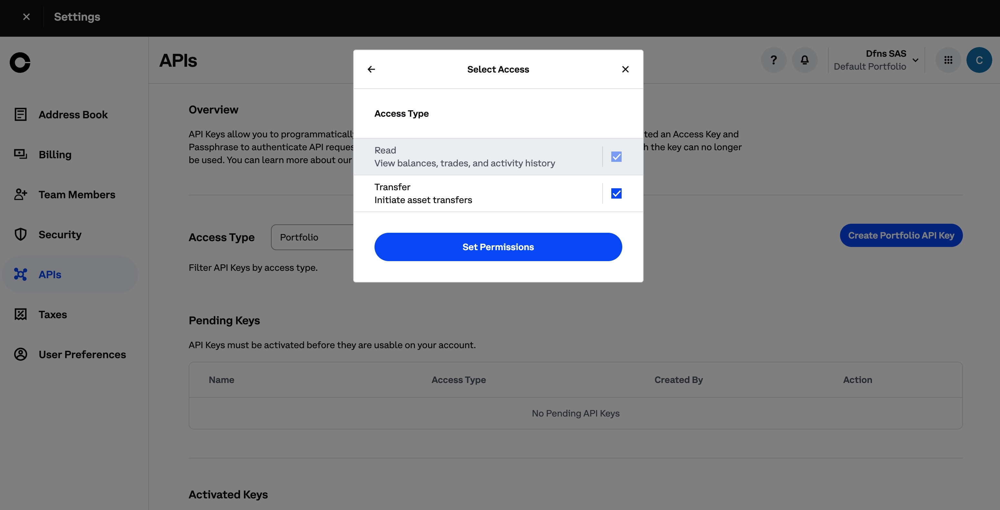

# Coinbase Prime Setup

Dfns support integrations with Coinbase Prime exchange accounts.

## API Key Generation

Log into your Coinbase Prime account and go to the Coinbase Prime homepage at [https://prime.coinbase.com/](https://prime.coinbase.com/).  From here, click **Settings** under the profile icon in the left menu and then on `API`. Click **Create Portfolio API Key** and generate a Read only key by selecting only the **Read** permission within the **Access Type** screen:&#x20;

<figure><figcaption></figcaption></figure>
<figure><figcaption></figcaption></figure>

In **Pending Keys**, click **Activate Key** for the newly created Read API Key. 

<figure><figcaption></figcaption></figure>
<figure><figcaption></figcaption></figure>

Log into your Dfns dashboard and click **Settings=>Exchanges=>New**. Copy the Access Key, Passphrase and Sigining API keys from Coinbase Prime into the corresponding fields. 

Go back to Coinbase Prime and generate a second Write API key this time activating **Transfer** in the Access Type screen.:

<figure><figcaption></figcaption></figure>

Copy the generated values into the Write API key fields in Dfns.  Click **Create** and the integration setup is complete.&#x20;

## Trusted Withdrawal Addresses

Coinbase Prime enforces **an address book** for all withdrawal wallet addresses. This means that before withdrawing any assets to an external wallet, the wallet address must be added to the address book in your Coinbase Prime account. Follow these steps to whitelist a wallet address using Coinbase Prime's standard interface:

1. **Initiate a withdrawal from the Dfns dashboard** to your desired Dfns wallet
   1. If your address is already in the *address book**, you will not have anything to do
   2. If your address is not in the *address book**, you will have an error message telling your to login to your Coinbase Prime Dashboard
2. **Log into your Coinbase Prime account.**
3. **Click on the notifications**, you should see a pending notification to add a trusted address.
4. **Click on Approve** to add the trusted address, the name of the address should start with `dfns-...`

This trusted address process adds an extra layer of security, ensuring that only authorized wallet addresses can receive withdrawals from your Coinbase Prime account.

<figure><figcaption></figcaption></figure>
